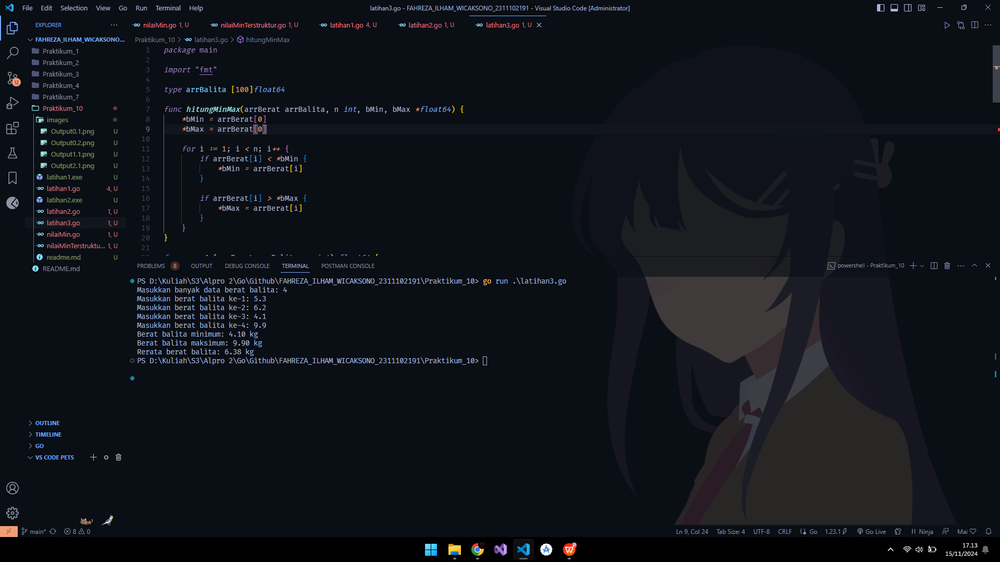

# <h1 align="center"> Laporan Praktikum Modul Pencarian Nilai Ekstrim Pada Himpunan Data </h1>

<p align="center"> Fahreza Ilham Wicaksono </p>

<p align="center"> 2311102191 </p>

## Contoh Mencari Nilai Minimum

```go
package main

import (
 "fmt"
)

type arrInt [2023]int

func terkecil_1(tabInt arrInt, n int) int {
 var min int = tabInt[0]
 var j int = 1

 for j < n {
  if min > tabInt[j] {
   min = tabInt[j]
  }

  j++
 }

 return min
}

func terkecil_2(tabInt arrInt, n int) int {
 var idk int = 0
 var j int = 1

 for j < n {
  if tabInt[idk] > tabInt[j] {
   idk = j
  }

  j++
 }

 return idk
}

func main() {
 var (
  n      int
  tabInt arrInt
 )

 fmt.Print("Masukkan jumlah elemen: ")
 fmt.Scanln(&n)

 for i := 0; i < n; i++ {
  fmt.Printf("Masukkan elemen ke-%d: ", i+1)
  fmt.Scan(&tabInt[i])
 }

 indexTerkecil := terkecil_2(tabInt, n)

 fmt.Printf("Elemen dengan index terkecil berada di index ke-%d yang bernilai %d", indexTerkecil, tabInt[indexTerkecil])
}

```

## Output


## Contoh Mencari Nilai Maksimum

```go
package main

import "fmt"

type Mahasiswa struct {
 nama, nim, kelas, jurusan string
 ipk                       float64
}

type arrMhs [2023]Mahasiswa

func IPK_2(T arrMhs, n int) int {
 var idx int = 0
 var j int = 1

 for j < n {
  if T[idx].ipk < T[j].ipk {
   idx = j
  }

  j++
 }

 return idx
}

func main() {
 var n int
 var data arrMhs

 fmt.Print("Masukkan jumlah mahasiswa (N <= 2023) : ")
 fmt.Scan(&n)

 if n <= 0 || n > 2023 {
  fmt.Println("Jumalah mahasiswa harus antara 1 dan 2023")
  return
 }

 for i := 0; i < n; i++ {
  fmt.Printf("Masukkan data mahasiswa ke-%d\n", i+1)
  fmt.Print("Nama: ")
  fmt.Scan(&data[i].nama)
  fmt.Print("NIM: ")
  fmt.Scan(&data[i].nim)
  fmt.Print("Kelas: ")
  fmt.Scan(&data[i].kelas)
  fmt.Print("Jurusan: ")
  fmt.Scan(&data[i].jurusan)
  fmt.Print("IPK: ")
  fmt.Scan(&data[i].ipk)
 }

 idxTertinggi := IPK_2(data, n)

 fmt.Println("\nMahasiswa dengan IPK tertinggi:")
 fmt.Printf("Nama    : %s\n", data[idxTertinggi].nama)
 fmt.Printf("NIM     : %s\n", data[idxTertinggi].nim)
 fmt.Printf("Kelas   : %s\n", data[idxTertinggi].kelas)
 fmt.Printf("Jurusan : %s\n", data[idxTertinggi].jurusan)
 fmt.Printf("IPK     : %.2f\n", data[idxTertinggi].ipk)
}

```

## Output


## Latihan 1

```go
package main

import "fmt"

func main() {
 var N int
 fmt.Print("masukan jumlah anak kelinci : ")
 fmt.Scan(&N)

 if N <= 0 || N > 1000 {
  fmt.Println("jumlah anak kelinci harus antara 1 dan 1000 ")
  return
 }

 weights := make([]float64, N)
 fmt.Println("Masukan berat anak kelinci : ")
 for i := 0; i < N; i++ {
  fmt.Scan(&weights[i])
 }

 minWeight, maxWeight := weights[0], weights[0]
 for _, weight := range weights[1:] {
  if weight < minWeight {
   minWeight = weight
  }
  if weight > maxWeight {
   maxWeight = weight
  }

 }

 fmt.Printf("Berat kelinci terkecil : %.2f\n", minWeight)
 fmt.Printf("Berat kelinci terbesar : %.2f\n", maxWeight)
}


```

## Output


## Latihan 2

```go
package main

import "fmt"

func main() {
 const nMax = 1000

 var (
  x, y  int
  berat [nMax]float64
  wadah []float64
 )

 fmt.Print("Masukkan jumlah ikan dan kapasitas per wadah: ")
 fmt.Scanln(&x, &y)

 fmt.Printf("Masukkan berat masing-masing ikan (jumlah = %d):\n", x)
 for i := 0; i < x; i++ {
  fmt.Scan(&berat[i])
 }

 for i := 0; i < x; i += y {
  total := 0.0

  for j := i; j < i+y && j < x; j++ {
   total += berat[j]
  }

  wadah = append(wadah, total)
 }

 fmt.Println("Total berat setiap wadah")

 for i, beratWadah := range wadah {
  fmt.Printf("Berat wadah %d : %.2f\n", i+1, beratWadah)
 }

 fmt.Println("Rata rata berat ikan di setiap wadah")

 for i, beratWadah := range wadah {
  fmt.Printf("Rata rata berat wadah %d : %.2f\n", i+1, beratWadah/float64(y))
 }
}

```

## Output


## Latihan 3

```go
package main

import "fmt"

type arrBalita [100]float64

func hitungMinMax(arrBerat arrBalita, n int, bMin, bMax *float64) {
 *bMin = arrBerat[0]
 *bMax = arrBerat[0]

 for i := 1; i < n; i++ {
  if arrBerat[i] < *bMin {
   *bMin = arrBerat[i]
  }

  if arrBerat[i] > *bMax {
   *bMax = arrBerat[i]
  }
 }
}

func rerata(arrBerat arrBalita, n int) float64 {
 var sum float64

 for i := 0; i < n; i++ {
  sum += arrBerat[i]
 }

 return sum / float64(n)
}

func main() {
 var (
  n          int
  arrBerat   arrBalita
  bMin, bMax float64
 )

 fmt.Print("Masukkan banyak data berat balita: ")
 fmt.Scanln(&n)

 if n <= 0 || n > 100 {
  fmt.Println("Banyak data balita harus diantara 1-100")
  return
 }

 for i := 0; i < n; i++ {
  fmt.Print("Masukkan berat balita ke-", i+1, ": ")
  fmt.Scanln(&arrBerat[i])
 }
 hitungMinMax(arrBerat, n, &bMin, &bMax)
 rataRata := rerata(arrBerat, n)

 fmt.Printf("Berat balita minimum: %.2f kg\n", bMin)
 fmt.Printf("Berat balita maksimum: %.2f kg\n", bMax)
 fmt.Printf("Rerata berat balita: %.2f kg", rataRata)
}

```

## Output


