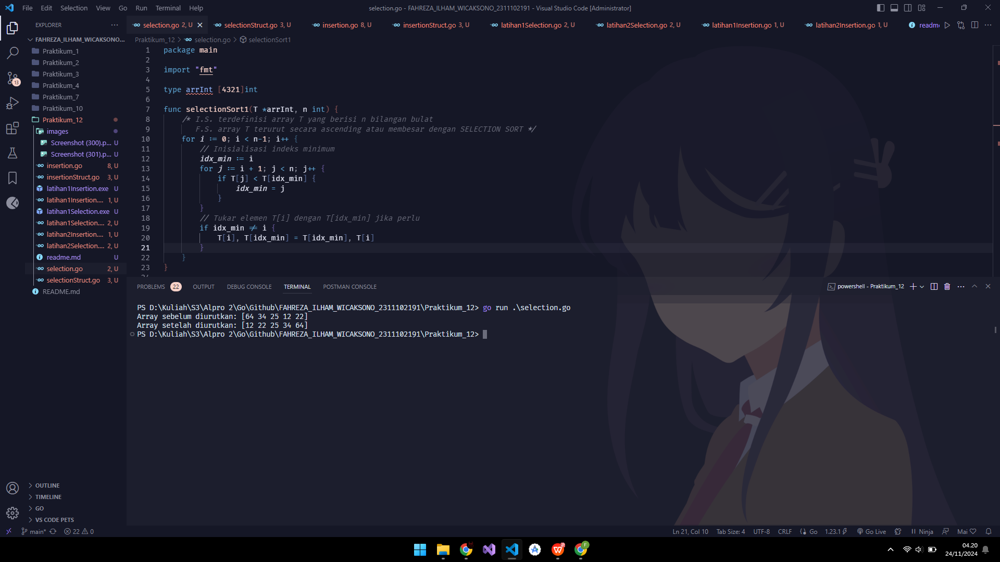
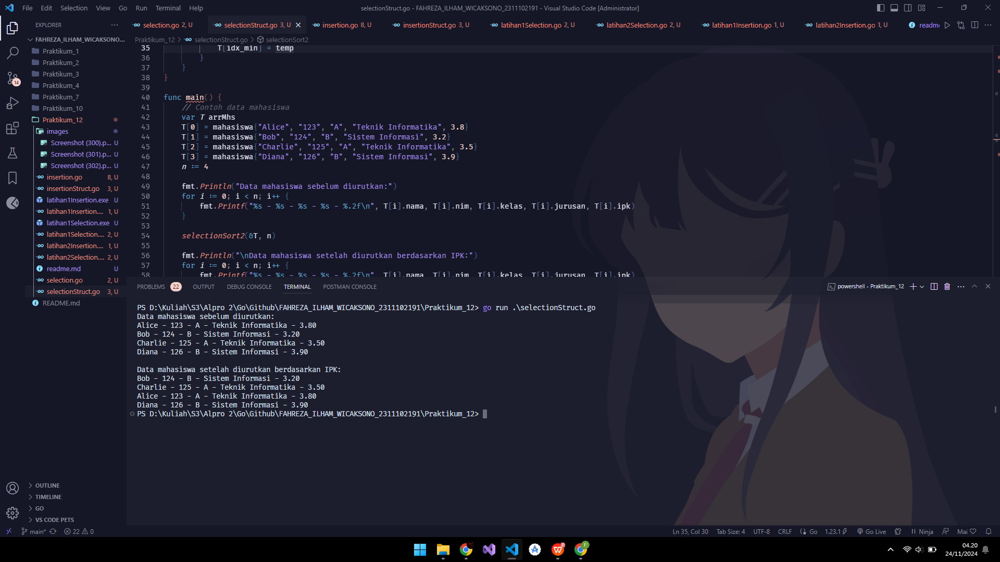
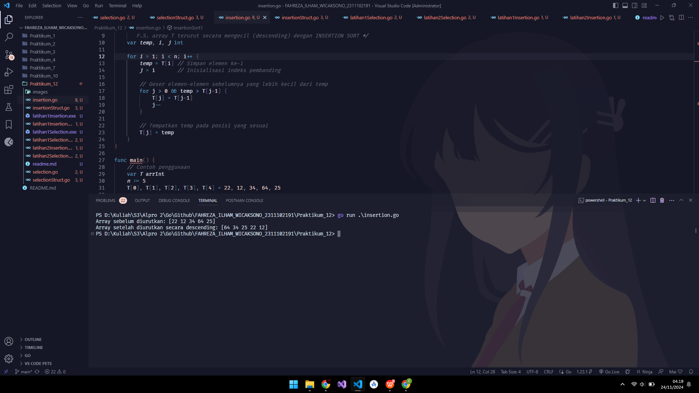
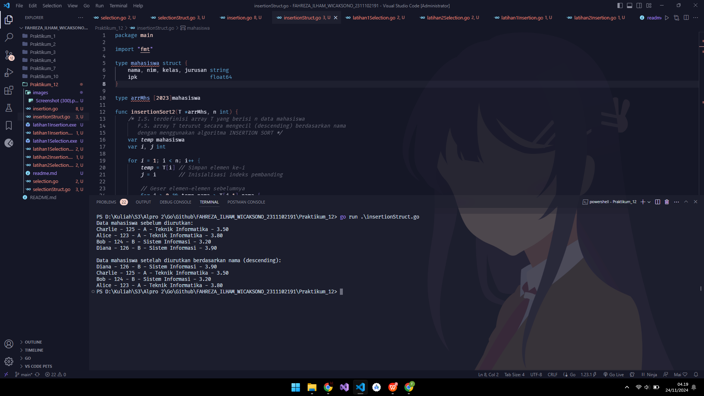
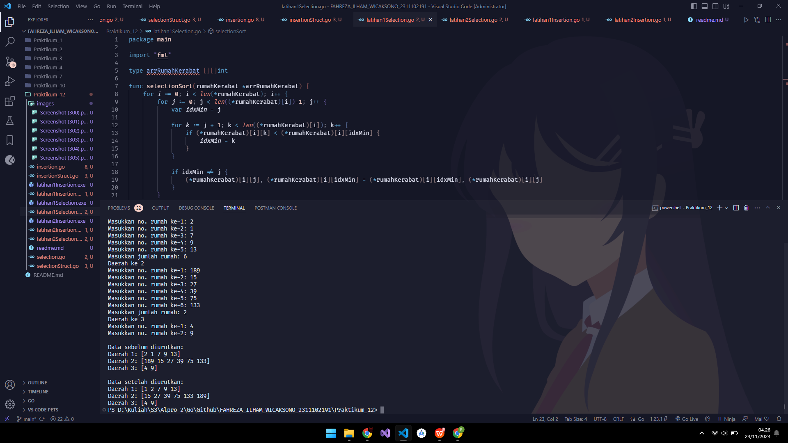
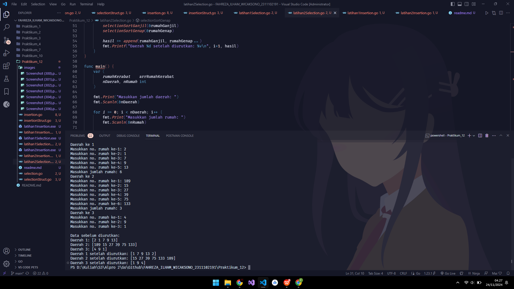
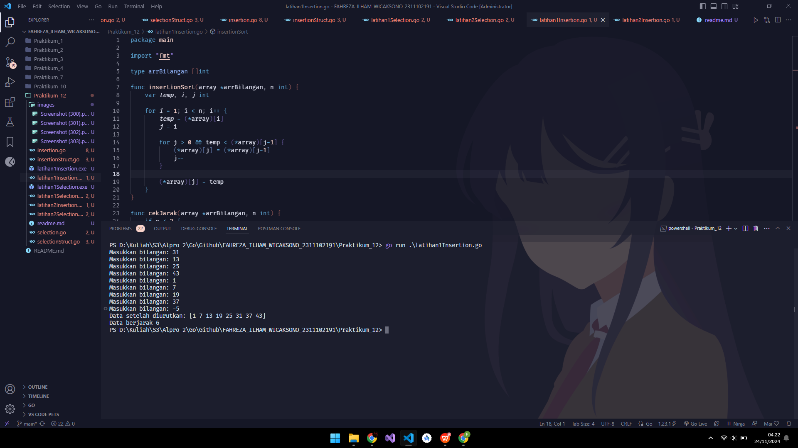
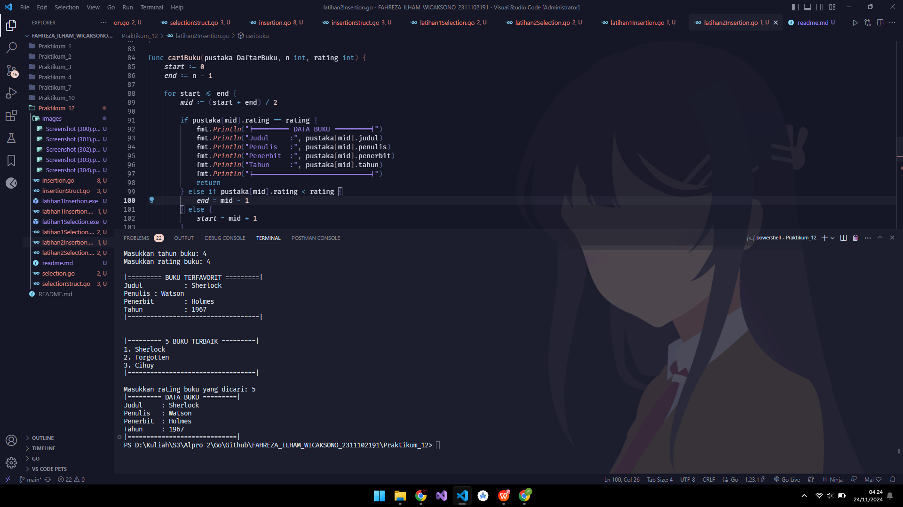

# <h1 align="center"> Pengurutan Data </h1>

<p align="center"> Fahreza Ilham Wicaksono </p>

<p align="center"> 2311102191 </p>

## Contoh Selection Sort

```go
package main

import "fmt"

type arrInt [4321]int

func selectionSort1(T *arrInt, n int) {
 /* I.S. terdefinisi array T yang berisi n bilangan bulat
    F.S. array T terurut secara ascending atau membesar dengan SELECTION SORT */
 for i := 0; i < n-1; i++ {
  // Inisialisasi indeks minimum
  idx_min := i
  for j := i + 1; j < n; j++ {
   if T[j] < T[idx_min] {
    idx_min = j
   }
  }
  // Tukar elemen T[i] dengan T[idx_min] jika perlu
  if idx_min != i {
   T[i], T[idx_min] = T[idx_min], T[i]
  }
 }
}

func main() {
 // Contoh penggunaan
 var T arrInt
 n := 5
 T[0], T[1], T[2], T[3], T[4] = 64, 34, 25, 12, 22

 fmt.Println("Array sebelum diurutkan:", T[:n])
 selectionSort1(&T, n)
 fmt.Println("Array setelah diurutkan:", T[:n])
}


```

## Output



## Contoh Selection Sort pada Struct

```go
package main

import "fmt"

type mahasiswa struct {
 nama, nim, kelas, jurusan string
 ipk                       float64
}

type arrMhs [2023]mahasiswa

func selectionSort2(T *arrMhs, n int) {
 /* I.S. terdefinisi array T yang berisi n data mahasiswa
    F.S. array T terurut secara ascending berdasarkan ipk dengan
    menggunakan algoritma SELECTION SORT */

 var idx_min int
 var temp mahasiswa

 for i := 0; i < n-1; i++ {
  // Inisialisasi indeks minimum
  idx_min = i

  // Cari elemen dengan IPK terkecil di subarray [i+1, n-1]
  for j := i + 1; j < n; j++ {
   if T[j].ipk < T[idx_min].ipk {
    idx_min = j
   }
  }

  // Tukar elemen di indeks i dengan elemen di idx_min jika perlu
  if idx_min != i {
   temp = T[i]
   T[i] = T[idx_min]
   T[idx_min] = temp
  }
 }
}

func main() {
 // Contoh data mahasiswa
 var T arrMhs
 T[0] = mahasiswa{"Alice", "123", "A", "Teknik Informatika", 3.8}
 T[1] = mahasiswa{"Bob", "124", "B", "Sistem Informasi", 3.2}
 T[2] = mahasiswa{"Charlie", "125", "A", "Teknik Informatika", 3.5}
 T[3] = mahasiswa{"Diana", "126", "B", "Sistem Informasi", 3.9}
 n := 4

 fmt.Println("Data mahasiswa sebelum diurutkan:")  
 for i := 0; i < n; i++ {
  fmt.Printf("%s - %s - %s - %s - %.2f\n", T[i].nama, T[i].nim, T[i].kelas, T[i].jurusan, T[i].ipk)
 }

 selectionSort2(&T, n)

 fmt.Println("\nData mahasiswa setelah diurutkan berdasarkan IPK:")
 for i := 0; i < n; i++ {
  fmt.Printf("%s - %s - %s - %s - %.2f\n", T[i].nama, T[i].nim, T[i].kelas, T[i].jurusan, T[i].ipk)
 }
}

```

## Output



## Contoh Insertion Sort

```go
package main

import "fmt"

type arrInt [4321]int

func insertionSort1(T *arrInt, n int) {
 /* I.S. terdefinisi array T yang berisi n bilangan bulat
    F.S. array T terurut secara mengecil (descending) dengan INSERTION SORT */
 var temp, i, j int

 for i = 1; i < n; i++ {
  temp = T[i] // Simpan elemen ke-i
  j = i       // Inisialisasi indeks pembanding

  // Geser elemen-elemen sebelumnya yang lebih kecil dari temp
  for j > 0 && temp > T[j-1] {
   T[j] = T[j-1]
   j--
  }

  // Tempatkan temp pada posisi yang sesuai
  T[j] = temp
 }
}

func main() {
 // Contoh penggunaan
 var T arrInt
 n := 5
 T[0], T[1], T[2], T[3], T[4] = 22, 12, 34, 64, 25

 fmt.Println("Array sebelum diurutkan:", T[:n])
 insertionSort1(&T, n)
 fmt.Println("Array setelah diurutkan secara descending:", T[:n])
}

```

## Output



## Contoh Insertion Sort pada Struct

```go
package main

import "fmt"

type mahasiswa struct {
 nama, nim, kelas, jurusan string
 ipk                       float64
}

type arrMhs [2023]mahasiswa

func insertionSort2(T *arrMhs, n int) {
 /* I.S. terdefinisi array T yang berisi n data mahasiswa
    F.S. array T terurut secara mengecil (descending) berdasarkan nama
    dengan menggunakan algoritma INSERTION SORT */
 var temp mahasiswa
 var i, j int

 for i = 1; i < n; i++ {
  temp = T[i] // Simpan elemen ke-i
  j = i       // Inisialisasi indeks pembanding

  // Geser elemen-elemen sebelumnya
  for j > 0 && temp.nama > T[j-1].nama {
   T[j] = T[j-1]
   j--
  }

  // Tempatkan temp pada posisi yang sesuai
  T[j] = temp
 }
}

func main() {
 // Contoh data mahasiswa
 var T arrMhs
 T[0] = mahasiswa{"Charlie", "125", "A", "Teknik Informatika", 3.5}
 T[1] = mahasiswa{"Alice", "123", "A", "Teknik Informatika", 3.8}
 T[2] = mahasiswa{"Bob", "124", "B", "Sistem Informasi", 3.2}
 T[3] = mahasiswa{"Diana", "126", "B", "Sistem Informasi", 3.9}
 n := 4

 fmt.Println("Data mahasiswa sebelum diurutkan:")
 for i := 0; i < n; i++ {
  fmt.Printf("%s - %s - %s - %s - %.2f\n", T[i].nama, T[i].nim, T[i].kelas, T[i].jurusan, T[i].ipk)
 }

 insertionSort2(&T, n)

 fmt.Println("\nData mahasiswa setelah diurutkan berdasarkan nama (descending):")
 for i := 0; i < n; i++ {
  fmt.Printf("%s - %s - %s - %s - %.2f\n", T[i].nama, T[i].nim, T[i].kelas, T[i].jurusan, T[i].ipk)
 }
}

```

## Output



## Latihan 1 Selection

```go
package main

import "fmt"

type arrRumahKerabat [][]int

func selectionSort(rumahKerabat *arrRumahKerabat) {
 for i := 0; i < len(*rumahKerabat); i++ {
  for j := 0; j < len((*rumahKerabat)[i])-1; j++ {
   var idxMin = j

   for k := j + 1; k < len((*rumahKerabat)[i]); k++ {
    if (*rumahKerabat)[i][k] < (*rumahKerabat)[i][idxMin] {
     idxMin = k
    }
   }

   if idxMin != j {
    (*rumahKerabat)[i][j], (*rumahKerabat)[i][idxMin] = (*rumahKerabat)[i][idxMin], (*rumahKerabat)[i][j]
   }
  }
 }
}

func main() {
 var (
  rumahKerabat    arrRumahKerabat
  nDaerah, nRumah int
 )

 fmt.Print("Masukkan jumlah daerah: ")
 fmt.Scanln(&nDaerah)

 for i := 0; i < nDaerah; i++ {
  fmt.Print("Masukkan jumlah rumah: ")
  fmt.Scanln(&nRumah)

  daerah := make([]int, 0, nRumah)
  fmt.Println("Daerah ke", i+1)

  for j := 0; j < nRumah; j++ {
   var noRumah int
   fmt.Printf("Masukkan no. rumah ke-%d: ", j+1)
   fmt.Scanln(&noRumah)
   daerah = append(daerah, noRumah)
  }

  rumahKerabat = append(rumahKerabat, daerah)
 }

 fmt.Println("\nData sebelum diurutkan:")
 for i, daerah := range rumahKerabat {
  fmt.Printf("Daerah %d: %v\n", i+1, daerah)
 }

 selectionSort(&rumahKerabat)

 fmt.Println("\nData setelah diurutkan:")
 for i, daerah := range rumahKerabat {
  fmt.Printf("Daerah %d: %v\n", i+1, daerah)
 }
}

```

## Output



## Latihan 2 Selection

```go
package main

import "fmt"

type arrRumahKerabat [][]int

func selectionSortGanjil(arrRumah *[]int) {
 for i := 0; i < len(*arrRumah); i++ {
  idxMin := i

  for j := i + 1; j < len(*arrRumah); j++ {
   if (*arrRumah)[j] < (*arrRumah)[idxMin] {
    idxMin = j
   }
  }

  if idxMin != i {
   (*arrRumah)[i], (*arrRumah)[idxMin] = (*arrRumah)[idxMin], (*arrRumah)[i]
  }
 }
}

func selectionSortGenap(arrRumah *[]int) {
 for i := 0; i < len(*arrRumah); i++ {
  idxMin := i

  for j := i + 1; j < len(*arrRumah); j++ {
   if (*arrRumah)[j] > (*arrRumah)[idxMin] {
    idxMin = j
   }
  }

  if idxMin != i {
   (*arrRumah)[i], (*arrRumah)[idxMin] = (*arrRumah)[idxMin], (*arrRumah)[i]
  }
 }
}

func urutkanGanjilGenap(rumahKerabat *arrRumahKerabat) {
 for i := 0; i < len(*rumahKerabat); i++ {
  var rumahGanjil, rumahGenap []int

  for _, noRumah := range (*rumahKerabat)[i] {
   if noRumah%2 == 0 {
    rumahGenap = append(rumahGenap, noRumah)
   } else {
    rumahGanjil = append(rumahGanjil, noRumah)
   }
  }

  selectionSortGanjil(&rumahGanjil)
  selectionSortGenap(&rumahGenap)

  hasil := append(rumahGanjil, rumahGenap...)
  fmt.Printf("Daerah %d setelah diurutkan: %v\n", i+1, hasil)
 }
}

func main() {
 var (
  rumahKerabat    arrRumahKerabat
  nDaerah, nRumah int
 )

 fmt.Print("Masukkan jumlah daerah: ")
 fmt.Scanln(&nDaerah)

 for i := 0; i < nDaerah; i++ {
  fmt.Print("Masukkan jumlah rumah: ")
  fmt.Scanln(&nRumah)

  daerah := make([]int, 0, nRumah)
  fmt.Println("Daerah ke", i+1)

  for j := 0; j < nRumah; j++ {
   var noRumah int
   fmt.Printf("Masukkan no. rumah ke-%d: ", j+1)
   fmt.Scanln(&noRumah)
   daerah = append(daerah, noRumah)
  }

  rumahKerabat = append(rumahKerabat, daerah)
 }

 fmt.Println("\nData sebelum diurutkan:")
 for i, daerah := range rumahKerabat {
  fmt.Printf("Daerah %d: %v\n", i+1, daerah)
 }

 urutkanGanjilGenap(&rumahKerabat)
}

```

## Output



## Latihan 1 Insertion

```go
package main

import "fmt"

type arrBilangan []int

func insertionSort(array *arrBilangan, n int) {
 var temp, i, j int

 for i = 1; i < n; i++ {
  temp = (*array)[i]
  j = i

  for j > 0 && temp < (*array)[j-1] {
   (*array)[j] = (*array)[j-1]
   j--
  }

  (*array)[j] = temp
 }
}

func cekJarak(array *arrBilangan, n int) {
 if n < 2 {
  fmt.Println("Data tidak cukup untuk menentukan jarak")
  return
 }

 var isEqual = true
 var distance = (*array)[1] - (*array)[0]

 for i := 1; i < n-1; i++ {
  if (*array)[i+1]-(*array)[i] != distance {
   isEqual = false
   break
  }
 }

 if isEqual {
  fmt.Printf("Data berjarak %d\n", distance)
 } else {
  fmt.Println("Data berjarak tidak tetap")
 }
}

func main() {
 var (
  array       arrBilangan
  n, bilangan int
 )

 for {
  fmt.Print("Masukkan bilangan: ")
  fmt.Scanln(&bilangan)

  if bilangan < 0 {
   break
  }

  array = append(array, bilangan)
  n++
 }

 insertionSort(&array, n)
 fmt.Println("Data setelah diurutkan:", array)

 cekJarak(&array, n)
}

```

## Output



## Latihan 2 Insertion

```go
package main

import (
 "fmt"
)

const nMax int = 7919

type DaftarBuku = [nMax]Buku

type Buku struct {
 id, judul, penulis, penerbit string
 eksemplar, tahun, rating     int
}

func daftarkanBuku(pustaka *DaftarBuku, n int) {
 for i := 0; i < n; i++ {
  fmt.Println("|========= Masukkan Data Buku =========|")

  fmt.Print("Masukkan ID buku: ")
  fmt.Scanln(&pustaka[i].id)

  fmt.Print("Masukkan judul buku: ")
  fmt.Scanln(&pustaka[i].judul)

  fmt.Print("Masukkan penulis buku: ")
  fmt.Scanln(&pustaka[i].penulis)

  fmt.Print("Masukkan penerbit buku: ")
  fmt.Scanln(&pustaka[i].penerbit)

  fmt.Print("Masukkan eksemplar buku: ")
  fmt.Scanln(&pustaka[i].eksemplar)

  fmt.Print("Masukkan tahun buku: ")
  fmt.Scanln(&pustaka[i].tahun)

  fmt.Print("Masukkan rating buku: ")
  fmt.Scanln(&pustaka[i].rating)
 }
}

func cetakFavorit(pustaka DaftarBuku, n int) {
 idxMax := 0

 for i := 1; i < n; i++ {
  if pustaka[i].rating > pustaka[idxMax].rating {
   idxMax = i
  }
 }

 fmt.Println("|========= BUKU TERFAVORIT =========|")
 fmt.Println("Judul  :", pustaka[idxMax].judul)
 fmt.Println("Penulis :", pustaka[idxMax].penulis)
 fmt.Println("Penerbit :", pustaka[idxMax].penerbit)
 fmt.Println("Tahun  :", pustaka[idxMax].tahun)
 fmt.Println("|===================================|")
}

func urutBuku(pustaka *DaftarBuku, n int) {
 var temp Buku

 for i := 0; i < n; i++ {
  temp = (*pustaka)[i]
  j := i

  for j > 0 && temp.rating > (*pustaka)[j-1].rating {
   (*pustaka)[j] = (*pustaka)[j-1]
   j--
  }

  (*pustaka)[j] = temp
 }
}

func cetak5Tertinggi(pustaka DaftarBuku, n int) {
 fmt.Println("|========= 5 BUKU TERBAIK =========|")
 for i := 0; i < 5 && i < n; i++ {
  fmt.Printf("%d. %s\n", i+1, pustaka[i].judul)
 }
 fmt.Println("|==================================|")
}

func cariBuku(pustaka DaftarBuku, n int, rating int) {
 start := 0
 end := n - 1

 for start <= end {
  mid := (start + end) / 2

  if pustaka[mid].rating == rating {
   fmt.Println("|========= DATA BUKU =========|")
   fmt.Println("Judul     :", pustaka[mid].judul)
   fmt.Println("Penulis   :", pustaka[mid].penulis)
   fmt.Println("Penerbit  :", pustaka[mid].penerbit)
   fmt.Println("Tahun     :", pustaka[mid].tahun)
   fmt.Println("|=============================|")
   return
  } else if pustaka[mid].rating < rating {
   end = mid - 1
  } else {
   start = mid + 1
  }
 }

 fmt.Println("Tidak ada buku dengan rating seperti itu")
}

func main() {
 var (
  Pustaka          DaftarBuku
  nPustaka, rating int
 )

 fmt.Print("Masukkan jumlah buku yang ingin didaftarkan: ")
 fmt.Scanln(&nPustaka)

 if nPustaka <= 0 || nPustaka > nMax {
  fmt.Println("Jumlah buku harus diantara 1 -", nMax)
  return
 }

 daftarkanBuku(&Pustaka, nPustaka)
 fmt.Println()

 cetakFavorit(Pustaka, nPustaka)
 fmt.Println()

 urutBuku(&Pustaka, nPustaka)
 fmt.Println()

 cetak5Tertinggi(Pustaka, nPustaka)
 fmt.Println()

 fmt.Print("Masukkan rating buku yang dicari: ")
 fmt.Scanln(&rating)

 cariBuku(Pustaka, nPustaka, rating)
}

```

## Output


