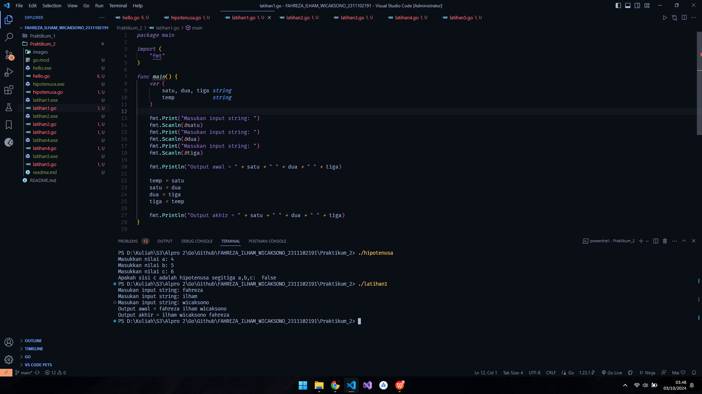

# <h1 align="center"> Laporan Praktikum Modul Review Struktur Kontrol </h1>

<p align="center"> Fahreza Ilham Wicaksono </p>

<p align="center"> 2311102191 </p>

## Code Hello

```go
package main

import (
 "fmt"
)

func main() {
 var greetings = "Selamat datang di dunia DAP"
 var a, b int

 fmt.Println(greetings)
 fmt.Scanln(&a, &b)
 fmt.Printf("%v + %v = %v\n", a, b, a+b)
}

```

## Output


## Code Hello Hipotenusa

```go
package main

import (
 "fmt"
)

func main() {
 var a, b, c float64
 var hipotenusa bool

 fmt.Print("Masukkan nilai A: ")
 fmt.Scanln(&a)
 fmt.Print("Masukkan nilai B: ")
 fmt.Scanln(&b)
 fmt.Print("Masukkan nilai C: ")
 fmt.Scanln(&c)

 hipotenusa = (c*c) == (a*a + b*b)

 fmt.Println("Apakah sisi c adalah hipotenusa segitiga a,b,c: ", hipotenusa)
}

```

## Output


## Code Hello Latihan 1

```go
package main

import (
 "fmt"
)

func main() {
 var (
  satu, dua, tiga string
  temp            string
 )

 fmt.Print("Masukan input string: ")
 fmt.Scanln(&satu)
 fmt.Print("Masukan input string: ")
 fmt.Scanln(&dua)
 fmt.Print("Masukan input string: ")
 fmt.Scanln(&tiga)

 fmt.Println("Output awal = " + satu + " " + dua + " " + tiga)

 temp = satu
 satu = dua
 dua = tiga
 tiga = temp

 fmt.Println("Output akhir = " + satu + " " + dua + " " + tiga)
}

```

## Output



## Code Hello Latihan 2

```go
package main

import "fmt"

func main()  {
 var (
  tahun int16
  kabisat bool
 )

 fmt.Print("Masukkan tahun: ")
 fmt.Scanln(&tahun)

 kabisat = (tahun % 400 == 0) || (tahun % 4 == 0 && tahun % 100 != 0)

 fmt.Println("Kabisat", kabisat)
}
```

## Output


## Code Hello Latihan 3

```go
package main

import (
 "fmt"
 // "strconv"
)

func main() {
 var (
  r, luas, volume float64
 )

 const phi float64 = 3.1415926535

 fmt.Print("Masukkan jejari: ")
 fmt.Scanln(&r)

 luas = 4 * phi * r * r
 volume = (4.0 / 3.0) * phi * r * r * r

 fmt.Printf("Bola dengan jejari %.2f memiliki volume %.4f dan luas kulit %.4f\n", r, volume, luas)
}
```

## Output


## Code Hello Latihan 4

```go
package main

import (
 "fmt"
 // "strconv"
)

func main() {
 var (
  celcius, fahrenheit, kelvin, reamur float32
 )

 fmt.Print("Masukkan suhu celcius: ")
 fmt.Scanln(&celcius)

 fahrenheit = (9.0 / 5.0) * celcius + 32
 reamur = (4.0 / 5.0) * celcius
 kelvin = celcius + 273.15

 fmt.Printf("Derajat Reamur %.2f \n", reamur)
 fmt.Printf("Derajat Fahrenheit %.2f \n", fahrenheit)
 fmt.Printf("Derajat Kelvin %.2f \n", kelvin)
}
```

## Output


## Code Hello Latihan 5

```go
package main

import (
	"fmt"
	// "strconv"
)

func main() {
	var (
		angka1, angka2, angka3, angka4, angka5 int16
		char1, char2, char3 string
	)

	fmt.Print("Masukkan 5 angka: ")
	fmt.Scanln(&angka1, &angka2, &angka3, &angka4, &angka5)

	fmt.Print("Masukkan 3 karakter: ")
	fmt.Scanln(&char1, &char2, &char3)

	fmt.Printf("%c%c%c%c%c \n", angka1, angka2, angka3, angka4, angka5)
	fmt.Printf("%c %c %c \n", char1[0]+1, char2[0]+1, char3[0]+1)
}
```

## Output


