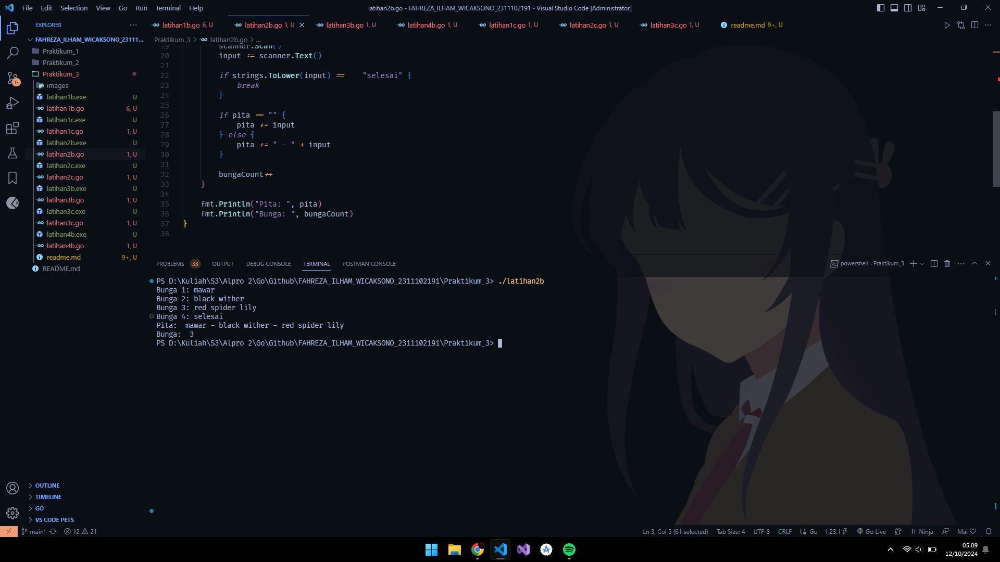
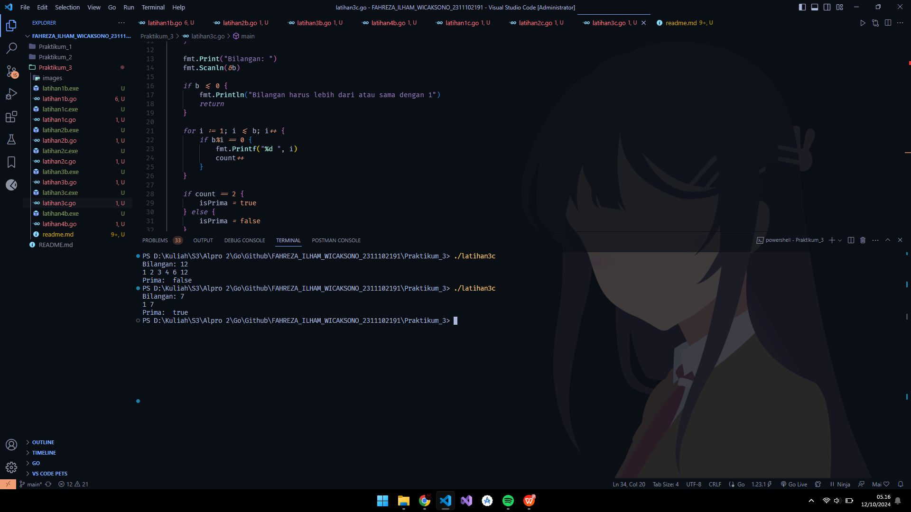

# <h1 align="center"> Laporan Praktikum Modul Review Struktur Kontrol Perulangan dan Perbangan </h1>

<p align="center"> Fahreza Ilham Wicaksono </p>

<p align="center"> 2311102191 </p>

## Perulangan - Latihan 1b

```go
package main

import (
 "fmt"
)

func main() {
 // deklarasi variabel
 var (
  warna1, warna2, warna3, warna4 string
 )

 urutanWarna := []string{"merah", "kuning", "hijau", "ungu"}
 hasil := true

 // perulangan 5 kali
 for i := 1; i <= 5; i++ {
  fmt.Printf("Percobaan %d \n", i)

  fmt.Print("Masukkan warna pertama: ")
  fmt.Scanln(&warna1)
  fmt.Print("Masukkan warna kedua: ")
  fmt.Scanln(&warna2)
  fmt.Print("Masukkan warna ketiga: ")
  fmt.Scanln(&warna3)
  fmt.Print("Masukkan warna keempat: ")
  fmt.Scanln(&warna4)

  // Cek apakah urutan sama
  if warna1 != urutanWarna[0] || warna2 != urutanWarna[1] || warna3 != urutanWarna[2] || warna4 != urutanWarna[3] {
   hasil = false
  }
 }

 // tampilkan hasil
 fmt.Printf("Berhasil: %t", hasil)
}


```

## Output


## Perulangan - Latihan 2b

```go
package main

import (
 "bufio"
 "fmt"
 "os"
 "strings"
)

func main() {
 scanner := bufio.NewScanner(os.Stdin)
 var (
  pita       string
  bungaCount int
 )

 for {
  fmt.Printf("Bunga %d: ", bungaCount+1)
  scanner.Scan()
  input := scanner.Text()

  if strings.ToLower(input) ==  "selesai" {
   break
  }

  if pita == "" {
   pita += input
  } else {
   pita += " - " + input
  }

  bungaCount++
 }

 fmt.Println("Pita: ", pita)
 fmt.Println("Bunga: ", bungaCount)
}


```

## Output



## Perulangan - Latihan 3b

```go
package main

import (
 "fmt"
)

func main() {
 var (
  beratKanan, beratKiri float64
  isOleng               bool
 )

 for {
  fmt.Print("Masukkan berat belanjaan di kedua kantong: ")
  fmt.Scanln(&beratKiri, &beratKanan)

  if beratKanan+beratKiri >= 150.0 || beratKanan < 0 || beratKiri < 0 {
   fmt.Println("Proses selesai")
   break
  }

  if beratKanan-beratKiri >= 9 || beratKiri-beratKanan >= 9 {
   isOleng = true
  } else {
   isOleng = false
  }

  fmt.Println("Sepeda motor pak Andi akan oleng: ", isOleng)
 }
}

```

## Output


## Perulangan - Latihan 4b

```go
package main

import (
 "fmt"
)

func akar(k int) float64 {
 hasil := 1.0

 for i := 0; i < k; i++ {
  pembilang := float64((4*i + 2) * (4*i + 2))
  penyebut := float64((4*i + 1) * (4*i + 3))
  hasil *= pembilang / penyebut
 }

 return hasil
}

func main() {
 var (
  k int
 )

 fmt.Print("Nilai K = ")
 fmt.Scanln(&k)

 fmt.Printf("Nilai akar 2 = %.10f", akar(k))
}

```

## Output


## Percabangan - Latihan 1c

```go
package main

import (
 "fmt"
)

func main()  {
 var (
  beratParsel, detailKg, detailGr, biayaKg, biayaGr, totalBiaya int
 )

 fmt.Print("Berat parsel (gram): ")
 fmt.Scanln(&beratParsel)

 detailKg = beratParsel / 1000
 detailGr = beratParsel % 1000

 biayaKg = detailKg * 10000

 if detailGr >= 500 {
  biayaGr = detailGr * 5 
 } else {
  biayaGr = detailGr * 15
 }

 if detailKg > 10 {
  totalBiaya = biayaKg
 } else {
  totalBiaya = biayaKg + biayaGr
 }

 fmt.Printf("Detail berat: %d kg + %d gr \n", detailKg, detailGr)
 fmt.Printf("Detail biaya: Rp. %d + Rp. %d \n", biayaKg, biayaGr )
 fmt.Println("Total biaya: Rp.", totalBiaya)
}
```

## Output


## Percabangan - Latihan 2c

### a. jika nam adalah 80.1 maka program akan error karena pada pogram tersebut variabel yang dimodifikasi adalah nam bukan nmk yang mana nam merupakan float dan nam dimodifikasi menjadi string dan jika pun yang dimodifikasi adalah nmk hasilnya akan mencetak D karena kurangnya sepisifikasi kondisi

### b. Pengkondisian kurang lengkap dan modifikasi variabel salah, seharusnya pengkondisian juga mengecek apakah nilai yang diinput kurang dari batas maksimum suatu NMK dan variabel yang seharusnya dimodifikasi adalah nmk bukan nma, berikut kode yang diperbaiki

```go
package main

import (
 "fmt"
)

func main() {
 var (
  nam float64
  nmk string
 )

 fmt.Print("Nilai akhir mata kuliah: ")
 fmt.Scanln(&nam)

 if nam > 80 {
  nmk = "A"
 } else if nam > 72.5 && nam <= 80 {
  nmk = "AB"
 } else if nam > 65 && nam <= 72.5 {
  nmk = "B"
 } else if nam > 57.5 && nam <= 65 {
  nmk = "BC"
 } else if nam > 50 && nam <= 57.5 {
  nmk = "C"
 } else if nam > 40 && nam <= 50 {
  nmk = "D"
 } else {
  nmk = "E"
 }

 fmt.Println("Nilai mata kuliah: ", nmk)
}

```

## Output


## Percabangan - Latihan 3c

```go
package main

import (
 "fmt"
)

func main() {
 var (
  b, count int
  isPrima  bool
 )

 fmt.Print("Bilangan: ")
 fmt.Scanln(&b)

 if b <= 0 {
  fmt.Println("Bilangan harus lebih dari atau sama dengan 1")
  return
 }

 for i := 1; i <= b; i++ {
  if b%i == 0 {
   fmt.Printf("%d ", i)
   count++
  }
 }

 if count == 2 {
  isPrima = true
 } else {
  isPrima = false
 }

 fmt.Println("\nPrima: ", isPrima)
}

```

## Output


