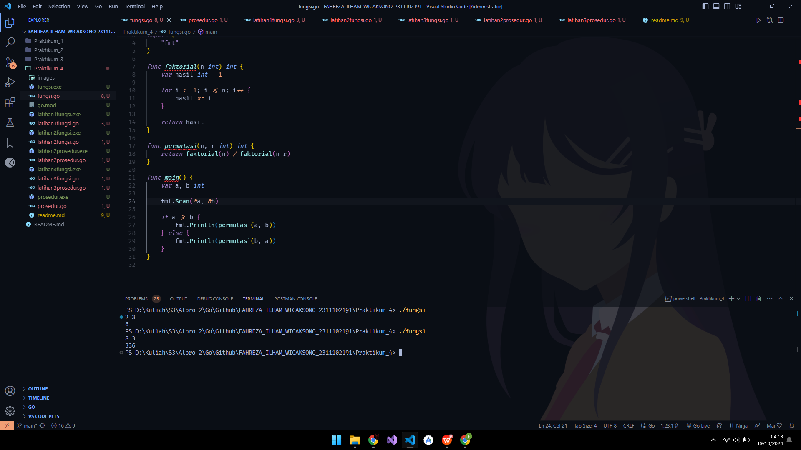
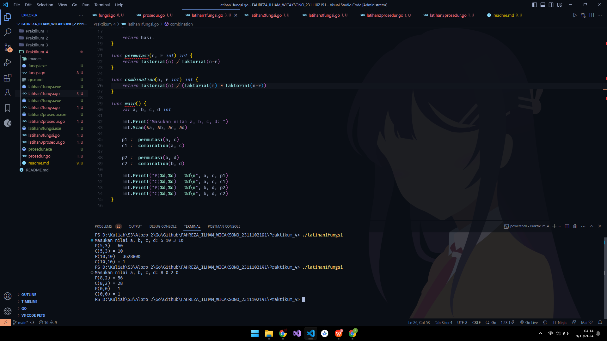
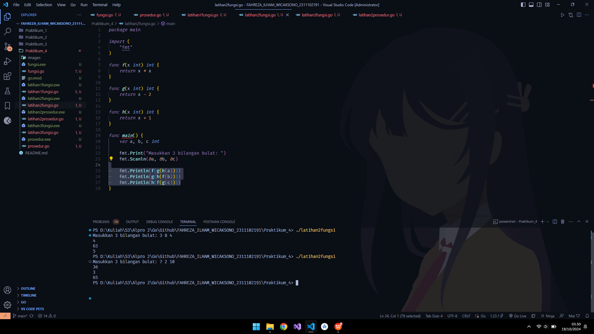
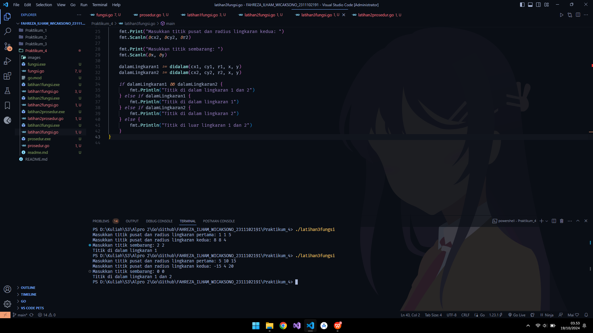
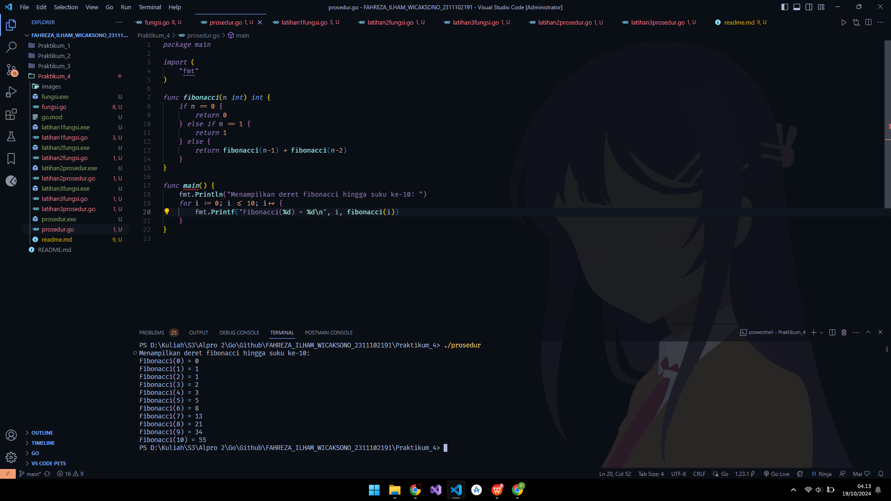
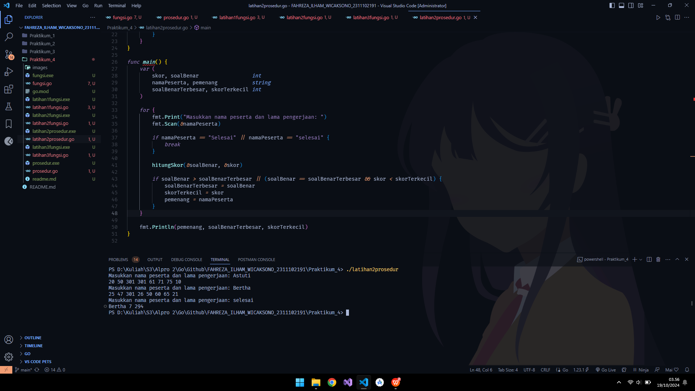
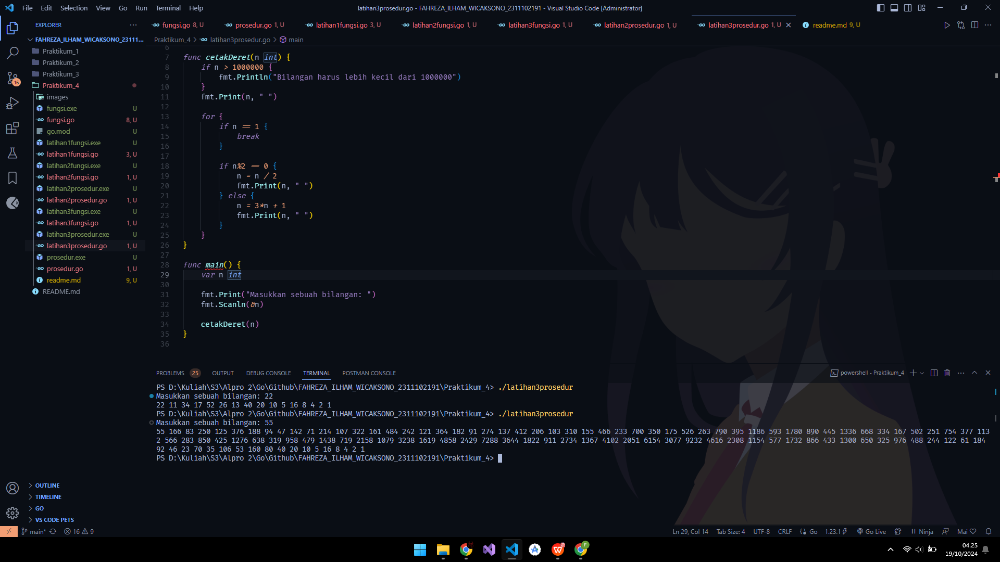

# <h1 align="center"> Laporan Praktikum Modul Fungsi dan Prosedur </h1>

<p align="center"> Fahreza Ilham Wicaksono </p>

<p align="center"> 2311102191 </p>

## Contoh Fungsi

```go
package main

import (
 "fmt"
)

func faktorial(n int) int {
 var hasil int = 1

 for i := 1; i <= n; i++ {
  hasil *= i
 }

 return hasil
}

func permutasi(n, r int) int {
 return faktorial(n) / faktorial(n-r)
}

func main() {
 var a, b int

 fmt.Scan(&a, &b)

 if a >= b {
  fmt.Println(permutasi(a, b))
 } else {
  fmt.Println(permutasi(b, a))
 }
}

```

## Output



## Fungsi - Latihan 1

```go
package main

import (
 "fmt"
)

func faktorial(n int) int {
 if n == 0 || n == 1 {
  return 1
 }

 var hasil int = 1

 for i := 1; i <= n; i++ {
  hasil *= i
 }

 return hasil
}

func permutasi(n, r int) int {
 return faktorial(n) / faktorial(n-r)
}

func combination(n, r int) int {
 return faktorial(n) / (faktorial(r) * faktorial(n-r))
}

func main() {
 var a, b, c, d int

 fmt.Print("Masukan nilai a, b, c, d: ")
 fmt.Scan(&a, &b, &c, &d)

 p1 := permutasi(a, c)
 c1 := combination(a, c)

 p2 := permutasi(b, d)
 c2 := combination(b, d)

 fmt.Printf("P(%d,%d) = %d\n", a, c, p1)
 fmt.Printf("C(%d,%d) = %d\n", a, c, c1)
 fmt.Printf("P(%d,%d) = %d\n", b, d, p2)
 fmt.Printf("C(%d,%d) = %d\n", b, d, c2)
}

```

## Output



## Fungsi - Latihan 2

```go
package main

import (
 "fmt"
)

func f(x int) int {
 return x * x
}

func g(x int) int {
 return x - 2
}

func h(x int) int {
 return x + 1
}

func main() {
 var a, b, c int

 fmt.Print("Masukkan 3 bilangan bulat: ")
 fmt.Scanln(&a, &b, &c)

 fmt.Println(f(g(h(a))))
 fmt.Println(g(h(f(b))))
 fmt.Println(h(f(g(c))))
}

```

## Output



## Fungsi - Latihan 3

```go
package main

import (
 "fmt"
 "math"
)

func jarak(a, b, c, d float64) float64 {
 return math.Sqrt((a-c)*(a-c) + (b-d)*(b-d))
}

func didalam(cx, cy, r, x, y float64) bool {
 return jarak(cx, cy, x, y) <= r
}

func main() {

 var (
  cx1, cx2, cy1, cy2, r1, r2, x, y float64
 )

 fmt.Print("Masukkan titik pusat dan radius lingkaran pertama: ")
 fmt.Scanln(&cx1, &cy1, &r1)

 fmt.Print("Masukkan titik pusat dan radius lingkaran kedua: ")
 fmt.Scanln(&cx2, &cy2, &r2)

 fmt.Print("Masukkan titik sembarang: ")
 fmt.Scanln(&x, &y)

 dalamLingkaran1 := didalam(cx1, cy1, r1, x, y)
 dalamLingkaran2 := didalam(cx2, cy2, r2, x, y)

 if dalamLingkaran1 && dalamLingkaran2 {
  fmt.Println("Titik di dalam lingkaran 1 dan 2")
 } else if dalamLingkaran1 {
  fmt.Println("Titik di dalam lingkaran 1")
 } else if dalamLingkaran2 {
  fmt.Println("Titik di dalam lingkaran 2")
 } else {
  fmt.Println("Titik di luar lingkaran 1 dan 2")
 }
}

```

## Output



## Contoh Prosedur

```go
package main

import (
 "fmt"
)

func fibonacci(n int) int {
 if n == 0 {
  return 0
 } else if n == 1 {
  return 1
 } else {
  return fibonacci(n-1) + fibonacci(n-2)
 }
}

func main() {
 fmt.Println("Menampilkan deret fibonacci hingga suku ke-10: ")
 for i := 0; i <= 10; i++ {
  fmt.Printf("Fibonacci(%d) = %d\n", i, fibonacci(i))
 }
}

```

## Output



## Prosedur - Latihan 2

```go
package main

import (
 "fmt"
)

func hitungSkor(soalBenar *int, skor *int) {
 var soal1, soal2, soal3, soal4, soal5, soal6, soal7, soal8 int

 *soalBenar = 0
 *skor = 0

 fmt.Scan(&soal1, &soal2, &soal3, &soal4, &soal5, &soal6, &soal7, &soal8)

 // Deklarasi dan inisalisasi array soal untuk kemudahan pengecekan
 soal := []int{soal1, soal2, soal3, soal4, soal5, soal6, soal7, soal8}

 for i := 0; i < 8; i++ {
  if soal[i] < 301 {
   *soalBenar++
   *skor += soal[i]
  }
 }
}

func main() {
 var (
  skor, soalBenar                 int
  namaPeserta, pemenang           string
  soalBenarTerbesar, skorTerkecil int
 )

 for {
  fmt.Print("Masukkan nama peserta dan lama pengerjaan: ")
  fmt.Scan(&namaPeserta)

  if namaPeserta == "Selesai" || namaPeserta == "selesai" {
   break
  }

  hitungSkor(&soalBenar, &skor)

  if soalBenar > soalBenarTerbesar || (soalBenar == soalBenarTerbesar && skor < skorTerkecil) {
   soalBenarTerbesar = soalBenar
   skorTerkecil = skor
   pemenang = namaPeserta
  }
 }

 fmt.Println(pemenang, soalBenarTerbesar, skorTerkecil)
}

```

## Output



## Prosedur - Latihan 3

```go
package main

import (
 "fmt"
)

func cetakDeret(n int) {
 if n > 1000000 {
  fmt.Println("Bilangan harus lebih kecil dari 1000000")
 }
 fmt.Print(n, " ")

 for {
  if n == 1 {
   break
  }

  if n%2 == 0 {
   n = n / 2
   fmt.Print(n, " ")
  } else {
   n = 3*n + 1
   fmt.Print(n, " ")
  }
 }
}

func main() {
 var n int

 fmt.Print("Masukkan sebuah bilangan: ")
 fmt.Scanln(&n)

 cetakDeret(n)
}

```

## Output


