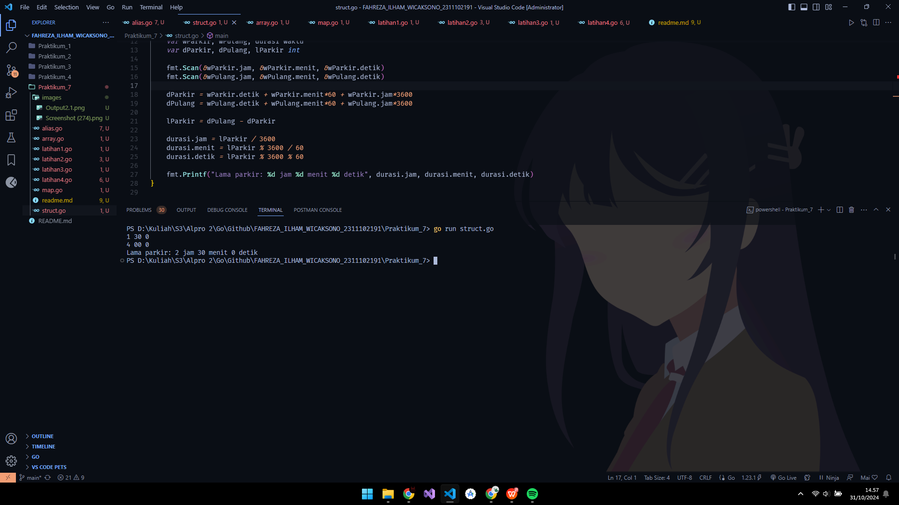
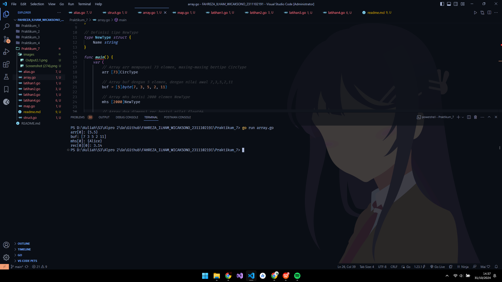
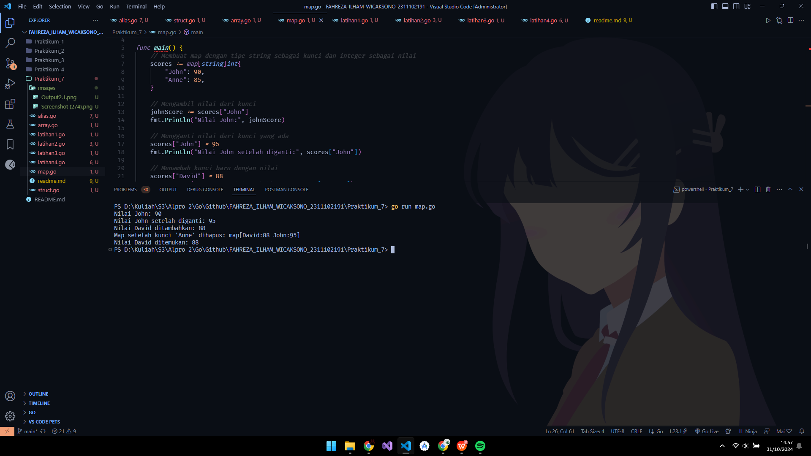
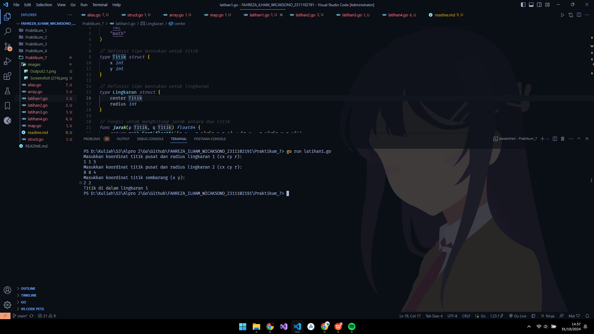
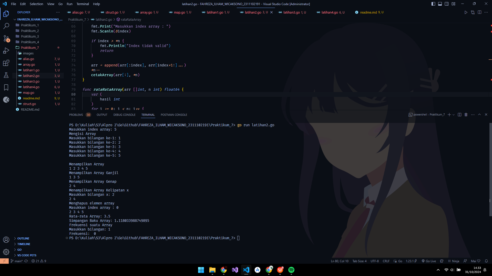
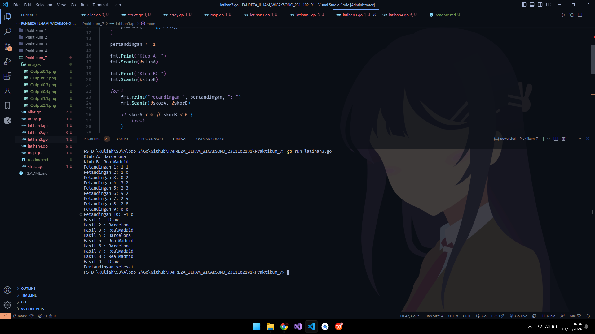
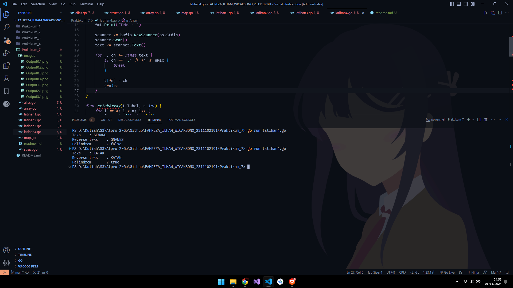

# <h1 align="center"> Laporan Praktikum Modul Struct dan Array </h1>

<p align="center"> Fahreza Ilham Wicaksono </p>

<p align="center"> 2311102191 </p>

## Contoh Alias

```go
package main

import "fmt"

type bilangan int
type pecahan float64

func main() {
 var a, b bilangan
 var hasil pecahan
 a = 9
 b = 5
 hasil = pecahan(a) / pecahan(b)
 fmt.Println(hasil)
}

```

## Output


## Contoh Struct

```go
package main

import (
 "fmt"
)

type waktu struct {
 jam, menit, detik int
}

func main() {
 var wParkir, wPulang, durasi waktu
 var dParkir, dPulang, lParkir int

 fmt.Scan(&wParkir.jam, &wParkir.menit, &wParkir.detik)
 fmt.Scan(&wPulang.jam, &wPulang.menit, &wPulang.detik)

 dParkir = wParkir.detik + wParkir.menit*60 + wParkir.jam*3600
 dPulang = wPulang.detik + wPulang.menit*60 + wPulang.jam*3600

 lParkir = dPulang - dParkir

 durasi.jam = lParkir / 3600
 durasi.menit = lParkir % 3600 / 60
 durasi.detik = lParkir % 3600 % 60

 fmt.Printf("Lama parkir: %d jam %d menit %d detik", durasi.jam, durasi.menit, durasi.detik)
}
```

## Output



## Contoh Array

```go
package main

import "fmt"

// Definisi tipe CircType
type CircType struct {
 Radius float64
}

// Definisi tipe NewType
type NewType struct {
 Name string
}

func main() {
 var (
  // Array arr mempunyai 73 elemen, masing-masing bertipe CircType
  arr [73]CircType

  // Array buf dengan 5 elemen, dengan nilai awal 7,3,5,2,11
  buf = [5]byte{7, 3, 5, 2, 11}

  // Array mhs berisi 2000 elemen NewType
  mhs [2000]NewType

  // Array dua dimensi rec berisi nilai float64
  rec [20][40]float64
 )

 // Mengisi beberapa elemen contoh
 arr[0] = CircType{Radius: 5.5}
 mhs[0] = NewType{Name: "Alice"}
 rec[0][0] = 3.14

 // Contoh penggunaan variabel
 fmt.Println("arr[0]:", arr[0])
 fmt.Println("buf:", buf)
 fmt.Println("mhs[0]:", mhs[0])
 fmt.Println("rec[0][0]:", rec[0][0])
}

```

## Output



## Contoh Map

```go
package main

import "fmt"

func main() {
 // Membuat map dengan tipe string sebagai kunci dan integer sebagai nilai
 scores := map[string]int{
  "John": 90,
  "Anne": 85,
 }

 // Mengambil nilai dari kunci
 johnScore := scores["John"]
 fmt.Println("Nilai John:", johnScore)

 // Mengganti nilai dari kunci yang ada
 scores["John"] = 95
 fmt.Println("Nilai John setelah diganti:", scores["John"])

 // Menambah kunci baru dengan nilai
 scores["David"] = 88
 fmt.Println("Nilai David ditambahkan:", scores["David"])

 // Menghapus kunci dari map
 delete(scores, "Anne")
 fmt.Println("Map setelah kunci 'Anne' dihapus:", scores)

 // Mengecek apakah kunci ada dalam map
 if score, ada := scores["David"]; ada {
  fmt.Println("Nilai David ditemukan:", score)
 } else {
  fmt.Println("Nilai David tidak ditemukan")
 }
}

```

## Output



## Latihan 1

```go
package main

import (
 "fmt"
 "math"
)

// Definisi tipe bentukan untuk titik
type Titik struct {
 x int
 y int
}

// Definisi tipe bentukan untuk lingkaran
type Lingkaran struct {
 center Titik
 radius int
}

// Fungsi untuk menghitung jarak antara dua titik
func jarak(p Titik, q Titik) float64 {
 return math.Sqrt(float64((p.x - q.x)*(p.x-q.x) + (p.y - q.y)*(p.y-q.y)))
}

// Fungsi untuk menentukan apakah titik berada di dalam lingkaran
func didalam(c Lingkaran, p Titik) bool {
 return jarak(p, c.center) < float64(c.radius)
}

func main() {
 var (
  // Mengambil input untuk lingkaran 1
  lingkaran1 Lingkaran
  // Mengambil input untuk lingkaran 2
  lingkaran2 Lingkaran
  // Mengambil input untuk titik sembarang
  point Titik
 )

 // Input untuk lingkaran 1 (cx, cy, r)
 fmt.Println("Masukkan koordinat titik pusat dan radius lingkaran 1 (cx cy r):")
 fmt.Scan(&lingkaran1.center.x, &lingkaran1.center.y, &lingkaran1.radius)

 // Input untuk lingkaran 2 (cx, cy, r)
 fmt.Println("Masukkan koordinat titik pusat dan radius lingkaran 2 (cx cy r):")
 fmt.Scan(&lingkaran2.center.x, &lingkaran2.center.y, &lingkaran2.radius)

 // Input untuk titik sembarang (x, y)
 fmt.Println("Masukkan koordinat titik sembarang (x y):")
 fmt.Scan(&point.x, &point.y)

 // Mengecek posisi titik terhadap kedua lingkaran
 inLingkaran1 := didalam(lingkaran1, point)
 inLingkaran2 := didalam(lingkaran2, point)

 if inLingkaran1 && inLingkaran2 {
  fmt.Println("Titik di dalam lingkaran 1 dan 2")
 } else if inLingkaran1 {
  fmt.Println("Titik di dalam lingkaran 1")
 } else if inLingkaran2 {
  fmt.Println("Titik di dalam lingkaran 2")
 } else {
  fmt.Println("Titik di luar lingkaran 1 dan 2")
 }
}

```

## Output



## Latihan 2

```go
package main

import (
 "fmt"
 "math"
)

func isiArray(arr []int, n int) {
 var bil int

 for i := 0; i < n; i++ {
  fmt.Print("Masukkan bilangan ke-", i+1, ": ")
  fmt.Scanln(&bil)

  arr[i] = bil
 }

 fmt.Println()
}

func cetakArray(arr []int, n int) {
 for i := 0; i < n; i++ {
  fmt.Print(arr[i], " ")
 }

 fmt.Println()

}

func cetakArrayGanjil(arr []int, n int) {
 for i := 0; i < n; i++ {
  if arr[i]%2 != 0 {
   fmt.Print(arr[i], " ")
  }
 }
 fmt.Println()
}

func cetakArrayGenap(arr []int, n int) {
 for i := 0; i < n; i++ {
  if arr[i]%2 == 0 {
   fmt.Print(arr[i], " ")
  }
 }
 fmt.Println()
}

func cetakArrayKelipatan(arr []int, n int) {
 var x int

 fmt.Print("Masukkan bilangan x: ")
 fmt.Scanln(&x)

 for i := 0; i < n; i++ {
  if arr[i]%x == 0 {
   fmt.Print(arr[i], " ")
  }
 }

 fmt.Println()
}

func hapusArray(arr []int, n *int) {
 var index int

 fmt.Print("Masukkan index array : ")
 fmt.Scanln(&index)

 if index > *n {
  fmt.Println("Index tidak valid")
  return
 }

 arr = append(arr[:index], arr[index+1:]...)
 *n--
 cetakArray(arr[:], *n)
}

func rataRataArray(arr []int, n int) float64 {
 var (
  hasil int
 )
 for i := 0; i < n; i++ {
  hasil += arr[i]
 }

 return float64(hasil) / float64(n)
}

func simpanganBaku(arr []int, n int) float64 {
 var (
  jumlah float64
 )

 mean := rataRataArray(arr[:], n)

 for i := 0; i < n; i++ {
  diff := float64(arr[i]) - mean
  jumlah += diff * diff
 }

 variansi := jumlah / float64(n)

 return math.Sqrt(variansi)
}

func frekuensiBilangan(arr []int, n int) int {
 var bil, count int

 fmt.Print("Masukkan bilangan: ")
 fmt.Scanln(&bil)

 for i := 0; i < n; i++ {
  if arr[i] == bil {
   count++
  }
 }

 return count
}

func main() {
 const nMax = 1000

 var (
  arr [nMax]int
  n   int
 )

 fmt.Print("Masukkan index array: ")
 fmt.Scanln(&n)

 if n > nMax {
  fmt.Println("Index melebihi batas (1000)")
  return
 }

 fmt.Println("Mengisi Array")
 isiArray(arr[:], n)

 fmt.Println("Menampilkan Array")
 cetakArray(arr[:], n)

 fmt.Println("Menampilkan Array Ganjil")
 cetakArrayGanjil(arr[:], n)

 fmt.Println("Menampilkan Array Genap")
 cetakArrayGenap(arr[:], n)

 fmt.Println("Menampilkan Array Kelipatan x")
 cetakArrayKelipatan(arr[:], n)

 fmt.Println("Menghapus elemen array")
 hapusArray(arr[:], &n)

 rataRata := rataRataArray(arr[:], n)
 fmt.Print("Rata-rata Array: ", rataRata)
 fmt.Println()

 simpanganBaku := simpanganBaku(arr[:], n)
 fmt.Print("Simpangan Baku Array: ", simpanganBaku)
 fmt.Println()

 fmt.Println("Frekuensi suatu Array")
 frekuensi := frekuensiBilangan(arr[:], n)
 fmt.Println("Frekuensi: ", frekuensi)
}

```

## Output



## Latihan 3

```go
package main

import (
 "fmt"
)

func main() {
 var (
  klubA, klubB string
  skorA, skorB int
  pemenang     []string
 )

 pertandingan := 1

 fmt.Print("Klub A: ")
 fmt.Scanln(&klubA)

 fmt.Print("Klub B: ")
 fmt.Scanln(&klubB)

 for {
  fmt.Print("Petandingan ", pertandingan, ": ")
  fmt.Scanln(&skorA, &skorB)

  if skorA < 0 || skorB < 0 {
   break
  }

  if skorA > skorB {
   pemenang = append(pemenang, klubA)
  } else if skorA == skorB {
   pemenang = append(pemenang, "Draw")
  } else {
   pemenang = append(pemenang, klubB)
  }

  pertandingan++
 }

 for i := 0; i < len(pemenang); i++ {
  fmt.Println("Hasil", i+1, ":", pemenang[i])
 }

 fmt.Println("Pertandingan selesai")
}

```

## Output



## Latihan 4

```go
package main

import (
 "bufio"
 "fmt"
 "os"
)

const nMax int = 127

type Tabel [nMax]rune

func isiArray(t *Tabel, n *int) {
 fmt.Print("Teks : ")

 scanner := bufio.NewScanner(os.Stdin)
 scanner.Scan()
 text := scanner.Text()

 for _, ch := range text {
  if ch == '.' || *n >= nMax {
   break
  }

  t[*n] = ch
  (*n)++
 }
}

func cetakArray(t Tabel, n int) {
 for i := 0; i < n; i++ {
  fmt.Printf("%c", t[i])
 }

 fmt.Println()
}

func balikanArray(t *Tabel, n int) {
 for i := 0; i < n/2; i++ {
  t[i], t[n-1-i] = t[n-1-i], t[i]
 }
}

func palindrom(t Tabel, n int) bool {
 for i := 0; i < n/2; i++ {
  if t[i] != t[n-1-i] {
   return false
  }
 }

 return true
}

func main() {
 var t Tabel
 var n int

 isiArray(&t, &n)

 balikanArray(&t, n)
 fmt.Print("Reverse teks : ")
 cetakArray(t, n)

 isPalindrom := palindrom(t, n)
 fmt.Println("Palindrom ?", isPalindrom)

}

```

## Output


